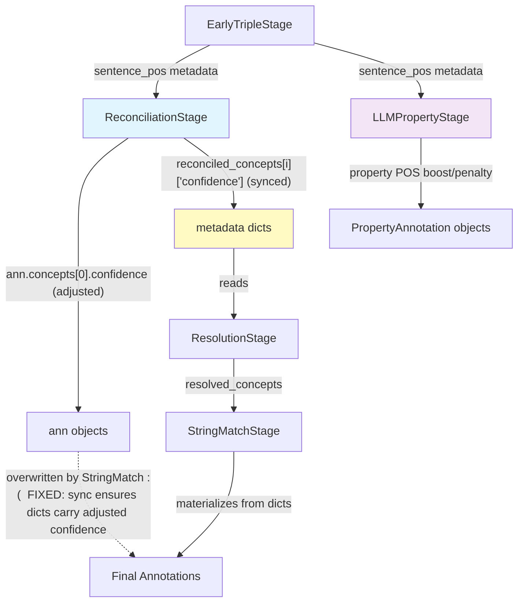

# feat: POS-Based Confidence Boosting for Concept and Property Classification

## Overview

In the FOLIO ontology (and every OWL ontology), **classes are nouns** and **properties are verbs/verb phrases**. The pipeline already produces POS tags via spaCy and currently only *penalizes* POS mismatches. This feature adds **affirmative confidence boosts** when POS tags *agree* with annotation type — creating a bidirectional POS scoring system that leverages the noun/verb distinction to improve classification accuracy.

## Problem Statement / Motivation

The current POS system is asymmetric — it only punishes bad signals but never rewards good ones:

| Current behavior | NOUN span | VERB span |
|---|---|---|
| Matched to **class** concept | No adjustment (missed opportunity) | -0.15 penalty |
| Matched to **property** | -0.12 penalty | No adjustment (missed opportunity) |

A NOUN-tagged span matched to a class concept is a *positive signal* that the match is correct, but the pipeline ignores it. Similarly, VERB-tagged property matches deserve a confidence boost. This feature fills that gap.

**Additionally**, the current penalty scope is narrow (single-word alternative-label matches only), while some POS signals like PROPN (proper nouns) and ADJ (adjectives) carry useful classification information that is currently unused.

## Proposed Solution

Add configurable POS-agreement boosts alongside existing penalties, applied in the same pipeline stages:

### Boost Table (New)

| POS Tag | Matched to Class | Matched to Property | Rationale |
|---|---|---|---|
| NOUN | **+0.10** | — | Nouns are classes in OWL |
| PROPN | **+0.12** | — | Proper nouns are almost always individuals/classes, never properties |
| ADJ | **+0.06** | — | Adjectives often correspond to classes ("contractual" → ContractualObligation) |
| VERB | — | **+0.10** | Verbs are properties in OWL |
| AUX | — | **+0.08** | Auxiliary verbs ("has", "is") correspond to properties like "isPartOf" |

### Penalty Table (Existing — Unchanged)

| POS Tag | Matched to Class | Matched to Property |
|---|---|---|
| VERB/ADV | -0.15 | — |
| NOUN/PROPN | — | -0.12 |

### Scope

- **Boosts**: All single-word matches (preferred, alternative, translation labels)
- **Penalties**: Single-word alternative-label matches only (unchanged)
- **Multi-word spans**: Excluded from both (inherently less ambiguous)
- **Property boosts**: Aho-Corasick matches only (mirrors penalty scope; LLM properties already contextually validated)

## Technical Approach

### Architecture

The implementation touches 4 files with a clear separation of concerns:

```
config.py          → New boost settings (2 base floats + POS multiplier constants)
reconciliation_stage.py → Concept boost logic (alongside existing penalty)
property_stage.py       → Property boost logic (alongside existing penalty)
test_pos_confidence.py  → New test classes for boost scenarios
```

### Critical Fix: POS Adjustments Must Target Metadata Dicts

**Discovery during planning**: The current POS penalty in `reconciliation_stage.py:164` modifies `ann.concepts[0].confidence` on Annotation objects. However, `StringMatchStage` (which runs 4 stages later) rebuilds annotations from `resolved_concepts` metadata dicts (`string_match_stage.py:121`), **overwriting the POS-adjusted confidence**. This means existing penalties are partially ineffective for annotations that get re-materialized.

**Fix**: POS adjustments must ALSO update the confidence in `reconciled_concepts` metadata dicts so the adjustment propagates through Resolution → StringMatch → final annotations.

**Data flow (corrected):**
```
ReconciliationStage
  ├─ Creates reconciled_concepts metadata dicts (with confidence)
  ├─ Updates annotation states
  └─ Applies POS boost/penalty to BOTH:
       (a) ann.concepts[0].confidence (for annotations that survive)
       (b) reconciled_concepts[i]["confidence"] (so it flows downstream)
           ↓
ResolutionStage (reads reconciled_concepts → produces resolved_concepts)
           ↓
StringMatchStage (reads resolved_concepts → materializes final annotations)
```

### Implementation Phases

#### Phase 1: Config + Data Flow Fix

**`app/config.py`** — Add 2 new settings in the "POS confidence modulation" section:

```python
# POS confidence modulation
pos_confidence_enabled: bool = True
pos_concept_mismatch_penalty: float = 0.15
pos_property_mismatch_penalty: float = 0.12
pos_branch_affinity_boost: float = 0.05
pos_concept_match_boost: float = 0.10      # NEW: base boost for POS-agreeing class concepts
pos_property_match_boost: float = 0.10     # NEW: base boost for POS-agreeing properties
```

Tag-specific multipliers as module-level constants (not config — too granular for operators):

```python
# In reconciliation_stage.py
_POS_CONCEPT_BOOST_MULTIPLIERS = {
    "NOUN": 1.0,    # base × 1.0 = 0.10
    "PROPN": 1.2,   # base × 1.2 = 0.12
    "ADJ": 0.6,     # base × 0.6 = 0.06
}

# In property_stage.py
_POS_PROPERTY_BOOST_MULTIPLIERS = {
    "VERB": 1.0,    # base × 1.0 = 0.10
    "AUX": 0.8,     # base × 0.8 = 0.08
}
```

**`app/pipeline/stages/reconciliation_stage.py`** — Fix data flow:

After `_apply_pos_penalties` modifies annotation confidence, also update the corresponding `reconciled_concepts` dict. Build a lookup from `(concept_text, folio_iri)` → reconciled dict to efficiently sync the adjusted confidence back.

```python
# After POS penalty/boost pass:
reconciled_by_key = {
    (d["concept_text"].lower(), d.get("folio_iri", "")): d
    for d in job.result.metadata.get("reconciled_concepts", [])
}
for ann in job.result.annotations:
    if ann.concepts:
        c = ann.concepts[0]
        key = (c.concept_text.lower(), c.folio_iri or "")
        rd = reconciled_by_key.get(key)
        if rd:
            rd["confidence"] = c.confidence
```

#### Phase 2: Concept Boost Logic

**`app/pipeline/stages/reconciliation_stage.py`** — Extend `_apply_pos_penalties` (rename to `_apply_pos_adjustments`):

```python
@staticmethod
def _apply_pos_adjustments(job: Job) -> tuple[int, int]:
    """Apply POS-based confidence boosts and penalties to annotations."""
    from app.config import settings
    from app.services.nlp.pos_lookup import get_majority_pos

    if not settings.pos_confidence_enabled or not settings.pos_tagging_enabled:
        return 0, 0

    sentence_pos = job.result.metadata.get("sentence_pos", [])
    if not sentence_pos:
        return 0, 0

    penalty = settings.pos_concept_mismatch_penalty
    boost_base = settings.pos_concept_match_boost
    boosted = 0
    penalized = 0

    for ann in job.result.annotations:
        if ann.state == "rejected" or not ann.concepts:
            continue

        concept = ann.concepts[0]
        span_text = ann.span.text

        # Only adjust single-word matches
        if " " in span_text.strip():
            continue

        pos = get_majority_pos(ann.span.start, ann.span.end, sentence_pos)
        if pos is None:
            continue

        # BOOST: POS agrees with class concept (noun-like)
        if pos in _POS_CONCEPT_BOOST_MULTIPLIERS:
            boost = boost_base * _POS_CONCEPT_BOOST_MULTIPLIERS[pos]
            concept.confidence = min(1.0, concept.confidence + boost)
            boosted += 1
            record_lineage(
                ann, "reconciliation", "pos_boosted",
                detail=f"POS agreement: {pos} for class concept '{concept.concept_text}'",
                confidence=concept.confidence,
            )

        # PENALTY: POS disagrees with class concept (verb-like) — existing logic
        elif pos in ("VERB", "ADV") and concept.match_type == "alternative":
            concept.confidence = max(0.0, concept.confidence - penalty)
            penalized += 1
            record_lineage(
                ann, "reconciliation", "pos_penalized",
                detail=f"POS mismatch: {pos} for noun concept '{concept.concept_text}'",
                confidence=concept.confidence,
            )
            if concept.confidence < 0.20:
                ann.state = "rejected"
                record_lineage(
                    ann, "reconciliation", "rejected",
                    detail="Confidence below 0.20 after POS penalty",
                )

    return boosted, penalized
```

**Activity log update**: Change message from `"{n} POS-adjusted"` to `"{boosted} POS-boosted, {penalized} POS-penalized"`.

#### Phase 3: Property Boost Logic

**`app/pipeline/stages/property_stage.py`** — Extend existing POS penalty pass:

Same pattern as concepts but for properties:
- VERB span → property: +boost_base × 1.0
- AUX span → property: +boost_base × 0.8
- Aho-Corasick matches only (skip LLM-sourced)
- Single-word only
- Lineage: `action="pos_boosted"`, `detail=f"POS agreement: {pos} for property '{prop.folio_label}'"`
- Upper clamp: `min(1.0, prop.confidence + boost)`

#### Phase 4: Tests

**`backend/tests/test_pos_confidence.py`** — New test classes:

**Concept boost tests:**
- `test_noun_span_boosts_class_concept` — NOUN tag → confidence increases by 0.10
- `test_propn_span_boosts_class_concept_stronger` — PROPN tag → confidence increases by 0.12
- `test_adj_span_boosts_class_concept_mild` — ADJ tag → confidence increases by 0.06
- `test_boost_applies_to_preferred_label` — Preferred-label NOUN match gets boosted (not just alternative)
- `test_boost_clamped_at_1_0` — Confidence 0.95 + 0.10 boost = 1.0, not 1.05
- `test_boost_skips_multiword_spans` — Multi-word spans get no boost
- `test_boost_disabled_when_pos_confidence_off` — `pos_confidence_enabled=False` → no boost
- `test_boost_zero_config_disables` — `pos_concept_match_boost=0.0` → no boost
- `test_no_double_boost_penalty` — Same span gets boost OR penalty, never both (mutually exclusive POS tags)
- `test_lineage_records_boost_event` — StageEvent with `action="pos_boosted"` recorded

**Property boost tests:**
- `test_verb_span_boosts_property` — VERB tag → property confidence increases by 0.10
- `test_aux_span_boosts_property` — AUX tag → property confidence increases by 0.08
- `test_property_boost_skips_llm_sourced` — LLM-sourced properties not boosted
- `test_property_boost_clamped_at_1_0` — Upper bound respected
- `test_property_boost_disabled_when_off` — Master switch respected

**Data flow tests:**
- `test_pos_adjustment_propagates_to_reconciled_concepts` — Confidence change synced to metadata dict
- `test_pos_adjustment_survives_string_match_stage` — Full pipeline: POS-adjusted confidence appears in final annotation

**Regression tests:**
- `test_existing_penalty_still_works` — VERB alternative-label concept still penalized -0.15
- `test_existing_property_penalty_still_works` — NOUN Aho-Corasick property still penalized -0.12

## System-Wide Impact

### Interaction Graph

```
EarlyTripleStage (produces sentence_pos)
    ↓
ReconciliationStage._apply_pos_adjustments()
    ├─ Modifies ann.concepts[0].confidence (boost or penalty)
    ├─ Syncs confidence back to reconciled_concepts metadata dict   ← NEW
    ├─ Records StageEvent in ann.lineage
    └─ May reject annotation if penalty drops below 0.20
    ↓
ResolutionStage (reads reconciled_concepts → embedding blending → resolved_concepts)
    ↓  (60/40 blend may dilute POS adjustment by ~40%)
BranchJudgeStage._pos_branch_affinity()
    ↓  (additional ±0.05 POS-branch adjustment — compounds with boost/penalty)
StringMatchStage (materializes annotations from resolved_concepts)
    ↓
LLMPropertyStage._apply_pos_penalties() → also applies property boosts   ← MODIFIED
    ↓
Frontend (displays confidence, lineage events)
```

### Error Propagation

- **spaCy POS mis-tagging**: A word like "grant" tagged NOUN when used as a verb would receive a class boost instead of a penalty — net swing of +0.25. Mitigated by moderate boost magnitudes and the multi-stage pipeline.
- **Missing sentence_pos data**: Guard clause returns (0, 0) — no adjustments applied. Happens when `triple_extraction_enabled=False` or `pos_tagging_enabled=False`.

### State Lifecycle Risks

- **Boost cannot promote state**: A boosted annotation stays at its current state (preliminary/confirmed). Only penalties can change state (→ rejected below 0.20). This is intentional — POS agreement is a confidence signal, not a state change trigger.
- **Metadata sync**: The new reconciled_concepts sync must happen after ALL POS adjustments in ReconciliationStage, before the method returns.

### API Surface Parity

- No API changes needed. Boosts/penalties are internal confidence adjustments.
- Frontend lineage display already handles arbitrary `StageEvent` actions — "pos_boosted" will render automatically.
- All 13 export formats include confidence scores and will reflect the adjusted values.

## Acceptance Criteria

### Functional Requirements

- [x] NOUN-tagged single-word class concept span → confidence boosted by `pos_concept_match_boost × 1.0`
- [x] PROPN-tagged single-word class concept span → confidence boosted by `pos_concept_match_boost × 1.2`
- [x] ADJ-tagged single-word class concept span → confidence boosted by `pos_concept_match_boost × 0.6`
- [x] VERB-tagged single-word property span → confidence boosted by `pos_property_match_boost × 1.0`
- [x] AUX-tagged single-word property span → confidence boosted by `pos_property_match_boost × 0.8`
- [x] Boosts apply to all single-word matches (preferred, alternative, translation labels)
- [x] Existing penalties unchanged (scope, magnitude, behavior)
- [x] Confidence clamped to [0.0, 1.0] after any adjustment
- [x] POS adjustments propagate to `reconciled_concepts` metadata dicts (data flow fix)
- [x] `pos_confidence_enabled=False` disables all boosts AND penalties
- [x] `pos_concept_match_boost=0.0` / `pos_property_match_boost=0.0` disables respective boosts
- [x] StageEvent with `action="pos_boosted"` recorded in annotation lineage
- [x] Activity log shows separate boost and penalty counts

### Non-Functional Requirements

- [x] No additional spaCy calls — reuses existing `sentence_pos` metadata
- [x] No measurable latency increase (POS lookup is O(n) per annotation, already done for penalties)
- [x] All existing tests continue to pass

### Quality Gates

- [x] All new tests pass
- [x] Full test suite passes (600+ tests)
- [ ] Manual verification: process a legal document and confirm NOUN class concepts show "pos_boosted" lineage events

## Success Metrics

- **Precision**: Fewer false-positive class annotations for verb-ambiguous legal terms (existing penalty) + higher confidence for correctly matched noun concepts (new boost)
- **Observable**: Lineage events clearly show POS boost/penalty decisions per annotation
- **Configurable**: Operators can tune boost magnitude per deployment via env vars

## Dependencies & Risks

| Risk | Likelihood | Impact | Mitigation |
|---|---|---|---|
| spaCy mis-tags ambiguous legal words | Medium | Medium | Moderate boost magnitudes limit damage; multi-stage pipeline provides correction opportunities |
| Boost inflates already-high preferred-label confidence | Low | Low | Upper clamp at 1.0; preferred labels already ~0.90, boost to 1.0 is minimal |
| Resolution 60/40 blend dilutes POS adjustment | Certain | Low | Expected behavior — POS is one signal among many |
| Cumulative POS adjustment (reconciliation + branch judge) | Certain | Low | Max compound boost: +0.10 + 0.05 = +0.15. Acceptable range |

## Design Decisions

| Decision | Choice | Rationale |
|---|---|---|
| Boost scope wider than penalty scope | Intentional asymmetry | Preferred labels are high-signal; POS mismatch more likely spaCy error than actual mismatch. Boosts are lower risk than penalties. |
| 2 config fields, not 5 | Base value × hardcoded multiplier | Keeps operator config simple while preserving per-tag differentiation. 8 POS knobs would be overwhelming. |
| Property boosts Aho-Corasick only | Mirrors penalty scope | LLM-sourced properties already contextually validated; double-boosting is redundant. |
| No state promotion from boost | Boosts affect confidence, not state | State changes should require stronger evidence than POS agreement. Penalties can reject; boosts should not promote. |
| Rename `_apply_pos_penalties` → `_apply_pos_adjustments` | Reflects bidirectional nature | Method now does both boosts and penalties. |
| Separate lineage actions | `pos_boosted` vs `pos_penalized` | Operators and frontend can distinguish positive from negative POS adjustments in audit trail. |

## Files to Modify

| File | Changes |
|---|---|
| `backend/app/config.py` | Add `pos_concept_match_boost` and `pos_property_match_boost` settings |
| `backend/app/pipeline/stages/reconciliation_stage.py` | Add boost logic, rename method, fix metadata sync, update activity log |
| `backend/app/pipeline/stages/property_stage.py` | Add property boost logic, update activity log |
| `backend/tests/test_pos_confidence.py` | Add ~17 new test cases for boosts + data flow |

## ERD: Data Flow



## Sources & References

### Internal References

- POS penalty implementation: `backend/app/pipeline/stages/reconciliation_stage.py:131-178`
- Property POS penalty: `backend/app/pipeline/stages/property_stage.py:163-204`
- POS lookup utility: `backend/app/services/nlp/pos_lookup.py:60-67`
- Config settings: `backend/app/config.py:99-107`
- StringMatchStage annotation materialization: `backend/app/pipeline/stages/string_match_stage.py:115-179`
- Existing POS tests: `backend/tests/test_pos_confidence.py`
- SentencePOS model: `backend/app/models/annotation.py:141-153`
